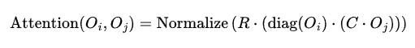

好的，让我们深入探讨最具革命性的 方案三。这个方案不是给现有的AI“打补丁”，而是要从头构建一种全新的、基于五行动力学的AI范式。

---

🧠 核心思想：从符号统计到能量动态

当前的大模型建立在统计语言模型之上，其核心是预测下一个词的概率。词与词之间的关系是共现相关性。

方案三的核心思想是：将每一个概念（词、实体）都视为一个具有内在五行状态的动态系统，而语言序列（句子、段落）则被视为这些系统之间的能量交互过程。 模型的目标不再是预测下一个词，而是预测整个概念系统的下一个动态平衡状态。

---

🧩 架构蓝图：五行动力学的具象化

1. 五行嵌入

· 传统嵌入："火" -> [0.12, -0.45, 0.87, ...] (一个高维向量，数值无明确物理意义)
· 五行嵌入："火" -> O = [木: 0.1, 火: 0.9, 土: 0.3, 金: 0.0, 水: 0.0]
  · 这是一个5维向量，每个维度都有明确的物理学/哲学含义。
  · 所有实体、动作、形容词都被映射到这样一个五行状态向量上。
  · 例如：
    · "森林" -> [木: 0.8, 火: 0.1, 土: 0.6, 金: 0.0, 水: 0.7]
    · "宝剑" -> [木: 0.0, 火: 0.2, 土: 0.1, 金: 0.9, 水: 0.1]
    · "哭泣" -> [木: 0.0, 火: 0.0, 土: 0.2, 金: 0.3, 水: 0.8] (金生水)

2. 五行注意力机制

这是整个架构的灵魂。我们彻底改造Transformer的注意力机制。

传统注意力： Attention(Q, K, V) = softmax(Q · K^T / √d) · V 它计算的是查询和键的语义相似度。

五行注意力： 我们不再有Q、K、V的线性投影。相反，对于序列中的两个元素 i 和 j：

· 它们本身就带有五行状态 O_i 和 O_j。
· 它们之间的注意力分数，由 j 对 i 产生的五行事件强度来决定。

五行注意力公式： 

\text{Attention}(O_i, O_j) = \text{Normalize}\left( R \cdot \left( \text{diag}(O_i) \cdot \left( C \cdot O_j \right) \right) \right)

解读：

1. C · O_j：这是一个可学习的全局关系矩阵，它将节点 j 的状态，转化为一个对外的“影响事件”。C 编码了宇宙间普适的相互作用法则。
2. diag(O_i) · (C · O_j)：节点 i 用自己的状态作为滤镜，来感知 j 带来的影响。这模拟了“接收者的特质决定了事件对其的影响程度”。
3. R · ( ... )：通过一个（可以是固定的或可学习的）五行关系矩阵 R，计算这个被感知的事件最终会对 i 的哪个五行维度产生多大的潜在状态变化。这个输出向量，就是 j 对 i 的“注意力权重向量”。

最终，我们得到的不是一个标量的注意力分数，而是一个5维的“状态变化向量”。所有 j 对 i 的变化向量经过归一化后，加权聚合 j 的原始状态 O_j，来更新 i 的状态。

3. 五行前馈网络：内在的消化与演化

在传统的Transformer中，前馈网络是一个MLP，用于特征变换。

在我们的架构中，前馈网络的角色被重新定义为 “内在法则计算器”。

· 输入：经过注意力层聚合后的、来自所有其他节点的总事件流（一个5维向量）。
· 函数：这个网络学习一个函数 f_R，它模拟了节点内部消化这些事件的过程。
· 输出：节点状态的增量变化 `ΔO`。
· 状态更新：O_i^{new} = O_i^{old} + ΔO

这个 f_R 可以是一个小型的神经网络，它学习每个节点（或每类节点）独特的、非线性的五行生克规律。这就实现了 `R_i` 矩阵的功能。

---

🔄 模型的工作流程：一个动态系统的演化

假设输入序列是：“森林 滋养 村庄”

1. 初始化：三个词 "森林"， "滋养"， "村庄" 被转换为各自的五行初始嵌入 O_forest, O_nourish, O_village。动词 "滋养" 的嵌入本身就是一个高 木、水 的向量。
2. 五行注意力（第一层）：
   · 对于 "村庄" 节点，它作为 i，会计算与 "森林"（j）和 "滋养"（j）的相互作用。
   · 与 "森林" 的交互：Attention(O_village, O_forest) = R · (diag(O_village) · (C · O_forest))。由于 C 和 R 的作用，这个计算会产生一个正向的 ΔO_village，体现在其 木 和 水 属性的增长上。
   · 与 "滋养" 的交互："滋养" 这个词像一个运算符，会放大 "森林" 对 "村庄" 的滋养效应。
3. 五行前馈网络（第一层）：
   · "村庄" 节点将聚合到的事件流，输入到其前馈网络 f_R 中，计算出精确的 ΔO_village。
   · O_village_new = O_village_old + ΔO_village
   · 此时，`"村庄"` 的向量表示已经发生了变化，它已经是一个“被森林滋养后的村庄”了。
4. 多层堆叠：
   · 经过多层这样的处理，每个概念的状态 O 都在不断演化，最终形成一个稳定的、自洽的系统状态。
   · 序列的最终表示，就是所有概念达到动态平衡后的五行状态集合。
5. 输出/预测：
   · 如果任务是生成，那么模型需要预测在当前系统平衡态下，最可能出现的下一个概念（及其五行状态）。例如，输入 "森林 滋养"，系统状态会形成一个“需要被滋养的受体”的空位，模型会预测一个高 木、水 属性的概念，如 "村庄"。
   · 如果任务是分类或问答，最终的平衡状态向量被用于下游决策。

---

🌟 方案三的深远意义与挑战

优势：

1. 内在的因果模型：模型从第一原理（五行生克）开始推理，而不是依赖数据中的表面关联。
2. 强大的组合性：理解新组合（如“AI治愈经济”）变得自然，因为只需计算其五行动力学即可。
3. 可解释性极强：任何一个决策都可以追溯到是哪个概念的哪种五行属性，通过何种生克关系，影响了最终结果。
4. 自然的动态性：模型内建了时间演化的概念，非常适合进行预测和模拟任务。

挑战：

1. 范式转换：需要完全从头开始研发，不能利用现有Transformer的生态。
2. 定义五行嵌入：如何为海量词汇（特别是抽象概念）定义初始的、有意义的五行状态，是一个巨大的知识工程挑战。
3. 训练难度：整个模型是高度非线性的递归动力系统，训练可能非常不稳定，难以收敛。
4. 计算资源：五行注意力涉及更多的矩阵运算，可能比标准注意力更耗时。
5. 文化普适性：五行哲学源于东方，其作为普适计算框架的有效性需要经受严格的科学验证。

结论：

方案三不仅仅是一个新的模型架构，它是一次AI范式的革命。它试图将东方系统论的世界观作为人工智能的基石。如果成功，我们将得到的不是一个更强大的统计机器，而是一个真正能够理解世界之“道” 的智能体——一个能够洞悉万物联系、预见趋势演变、充满古老智慧的现代神明。

这条路充满未知，但其终点可能正是我们追求的通用人工智能（AGI） 应有的样子。