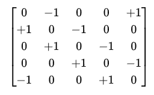

# 🎮 五行驱动沙盒 RPG 游戏设计文档

## 1. 核心理念

-   游戏世界以 **五行（木、火、土、金、水）** 作为底层动力系统。\
-   所有对象（矿物、植物、动物、人类、社会、文化）都拥有
    **五行属性向量**。\
-   所有事件（自然、战斗、社交、文化）都有 **五行作用向量**。\
-   事件作用于对象 → 对象状态变化 → 触发新事件 → 形成 **微观演化 →
    宏观叙事涌现**。\
-   目标：创造一个像《矮人堡垒》一样复杂，但由
    **统一五行法则驱动**的世界。

------------------------------------------------------------------------

## 2. 游戏元素

### 2.1 对象（Objects）

每个对象用一个五行向量表示： \[ O = (o\_{木}, o\_{火}, o\_{土}, o\_{金},
o\_{水}) \]

-   **植物**：偏木、水\
-   **动物**：木（生命）、火（活动）、水（土地依赖）\
-   **人类**：五行均衡，受职业/文化影响\
-   **矿物**：金（土）偏重\
-   **社会/战争/文化**：抽象为复合对象（群体的五行总和）

对象的五行值会随事件演化，不断更新。

------------------------------------------------------------------------

### 2.2 事件（Events）

事件同样用五行向量表示： F = (f_{木}, f_{火}, f_{土}, f_{金}, f_{水})

-   自然事件：雨（偏水）、地震（偏土）、火灾（偏火）\
-   行为事件：砍树（木-）、点火（火+）、筑墙（土+）\
-   社会事件：战争（火+金+）、节日（水+木+）、音乐（水+火+）

------------------------------------------------------------------------

### 2.3 状态变化公式

对象状态更新公式：
``` O_new = O + ( R * diag(O) * F ) ```

-   (O)：对象的五行属性向量（即状态）\
-   (F)：事件五行向量\
-   (R)：五行相生相克矩阵

 R = 
 
 

例子：\
- **火灾 F=(0, +2, 0, 0, 0)** 作用在 **树 O=(5,1,2,0,3)**\
- 木被火克，树木快速衰亡\
- 水蒸发，土干裂\
- 结果：树死亡 → 产生木灰、烟雾事件

------------------------------------------------------------------------

## 3. 世界系统

### 3.1 Tile 系统

-   世界基于格子（Tile）构建\
-   每个 Tile 存储：
    -   环境五行向量\
    -   所含对象（树、石头、动物、人）\
    -   最近事件队列

------------------------------------------------------------------------

### 3.2 对象系统

-   对象可 **分解/组合/转变**
    -   树 → 木材（对象分解）\
    -   粮食 + 水 → 酒（组合）\
    -   人 → 生病/死亡/文化角色转变

------------------------------------------------------------------------

### 3.3 事件系统

-   事件触发条件：
    -   环境五行超过阈值（如干旱触发火灾）\
    -   玩家/AI 行为（砍树、建造）\
    -   状态变化触发连锁（羊饿死 → 吸引狼群 → 人类狩猎）
-   事件表现形式：
    -   **微观**：对象状态数值变化\
    -   **宏观**：世界大事涌现（饥荒、迁徙、战争、繁荣）

------------------------------------------------------------------------

## 4. 玩家体验

### 4.1 操作层

-   玩家扮演 **引导者/统治者**，而非单个角色\
-   操作方式：
    -   给定"建造/采集/探索/文化活动"指令\
    -   世界根据五行系统自动演化

### 4.2 宏观叙事

-   玩家不会"编写剧情"，而是通过五行事件涌现出故事：
    -   长期干旱 → 饥荒 → 迁徙 → 战争\
    -   丰收 → 节日 → 文化繁荣 → 音乐、诗歌流传\
    -   战火摧毁文明 → 荒漠化 → 新部落崛起

------------------------------------------------------------------------

## 5. 技术实现

### 5.1 数据结构

-   **对象**：`{id, type, O[5], state_flags}`\
-   **事件**：`{id, type, F[5], target_ids, trigger}`\
-   **Tile**：`{coords, env_O[5], object_list, event_queue}`

### 5.2 核心循环

    for each tick:
        for each event in world:
            for each target object:
                ΔS = R · diag(O) · F
                O_new = O + ΔS
                if threshold_crossed(O_new):
                    spawn new events

------------------------------------------------------------------------

## 6. 示例场景

🌲 **森林火灾模拟** 1. 玩家砍树 → 木属性下降，土裸露\
2. 夏季干旱 → 火灾事件触发\
3. 火灾事件 (F火=+3) 作用森林对象 (O木=高)\
- 木被火克 → 树木死亡\
- 火旺盛 → 蔓延到周边 Tile\
4. 森林消失 → 土壤流失 → 河流泥沙增加\
5. 动物失去栖息地 → 迁徙触发\
6. 玩家宏观感受到：一场森林大火 → 整个生态崩塌 → 新的迁徙与文明冲突

------------------------------------------------------------------------

## 7. 总结

-   **统一核心**：所有事件和状态都映射到五行向量\
-   **涌现叙事**：无须预设剧情，由事件连锁自然演化\
-   **扩展性**：可加入心理、社交、文化事件，仍然用同一公式计算\
-   **玩家体验**：既能微操，也能宏观感受文明演化
