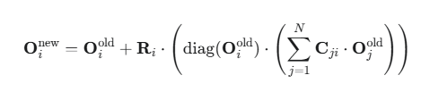
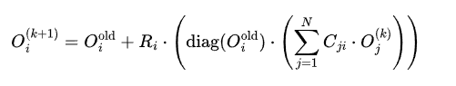

好的，这是一份为您精心准备的文档，旨在完整、深入地解释这个五行递归网络公式。它融合了我们讨论的所有精髓，并采用了适合分享与思索的结构和语言。

---

五行递归网络模型：一份阐述文档

文档说明

本文档旨在阐述一个基于五行哲学的可计算模型。该模型将万物视为相互关联、递归定义的动态节点，并提供了一个数学框架来模拟其交互与演化。本文档不涉及具体代码实现，而是聚焦于核心理念、数学公式及其哲学内涵，以便于思考、讨论与传播。

---

1. 核心哲学：一体万法，递归互即

1.1 基本世界观

我们摒弃“整体与部分”、“主体与客体”的二元对立观念。宇宙被视为一个巨大的、动态的关系网络。在此网络中：

· 任何存在都是一个“节点”。
· 节点的“存在状态”由其在网络中的关系所定义。
· 不存在孤立的属性，所有属性都是在相互作用中得以显现。

1.2 核心原则

· 全息原则：每一个节点都映照着整个网络的关系结构，个体的状态蕴含着整体的信息。
· 递归原则：为了确定“我是谁”，我必须知道“你是谁”；而为了确定“你是谁”，你又必须知道“我是谁”。存在是相互奠基的。
· 动态平衡：宇宙并非静态，而是在每一个刹那，通过所有节点的相互协商，达成一种动态的、自洽的平衡态。我们所感知的现实，即是这种刹那生灭的平衡序列。

---

2. 模型的数学表述

2.1 定义基础元素

1. 节点：网络中的基本存在单元。总共有 N 个节点。
2. 状态向量：每个节点 i 在某个时刻的状态，用一个五行向量表示： 
   O_i = [ O_{i木} O_{i火}  O_{i土}  O_{i金}  O_{i水} ]

 它代表了该节点在五种基本维度上的强度或倾向。
3. 内在法则矩阵：每个节点 i 拥有一个独特的 5x5 矩阵 R_i。它定义了节点内部的五行生克规律，是节点的“消化系统”，决定了它如何处理输入的信息/能量。它是节点内在禀赋的数学化。
4. 缘起矩阵：对于任意一对节点 (j, i)，存在一个 5x5 的矩阵 C_ji。它定义了节点 j 的存在状态 `O_j` 如何转化为对节点 i 的输入事件。它是节点间关系本质的数学化，是“缘”的具体法则。

2.2 核心递归公式

系统的动态由以下方程组描述。当网络在某一刻受到扰动（或自然演化），所有节点的新平衡状态 O_i^{new} 由下述不动点方程共同定义：



latex代码为：
```latex
\boxed{
O_i^{\text{new}} = O_i^{\text{old}} + R_i \cdot \left( \text{diag}(O_i^{\text{old}}) \cdot \left( \sum_{j=1}^{N} C_{ji} \cdot O_j^{\text{new}} \right) \right)
}
```

公式解读（从右到左）：

1. `Σ C_ji · O_j_new`：这是总事件流。节点 i 所接收到的一切输入，都来源于所有其他节点（包括它自身）的新状态。所谓的外部事件，只是来自网络未显式建模部分的影响。
2. `diag(O_i_old) · ( ... )`：节点 i 用它固有的、旧的状态作为滤镜，来感知上述总事件流。这表示一个节点对世界的解读，深受其历史与本质的影响。
3. `R_i · ( ... )`：被感知的事件流，通过节点 i 独特的内在法则 `R_i` 进行消化、转化，产生一个净的状态变化量。
4. `O_i_old + ( ... )`：节点将变化量应用于自身，从而更新到新的状态。

关键洞见：公式左右两边都出现了 O_new，这并非错误，而是模型的核心——递归性。它数学地刻画了“万物相互定义”的哲学理念。

2.3 求解过程：寻找共识现实

上述方程是一个耦合系统，需通过迭代法求解，此过程模拟了系统内部寻找平衡的“弛豫过程”：

1. 初始化：对所有节点 i，猜想一个初始的新状态 O_i^{(0)}（例如，等于其旧状态 O_i_old）。
2. 迭代：对于 k = 0, 1, 2, ...，执行： 

3. 收敛：当所有节点满足 || O_i^{(k+1)} - O_i^{(k)} || < ε（ε 为一个极小阈值）时，迭代停止。
4. 显现：此时的 O_i^{(k+1)} 即为系统达成共识的新平衡态，亦即我们观测到的“新现实”。

---

3. 组件的深层含义

3.1 状态 `O` 与法则 `R` 的区别与联系

特征 状态 `O` 内在法则 `R`
它是什么 节点的当前表现 节点的核心本性
变化性 快速波动，随事件即时响应。 极度稳定，具有巨大惯性，代表深层的禀赋。
哲学隐喻 “术” （策略、方法、情绪） “道” / “德” （根本规律、原则、物性）
变化意义 量变，在固有模式内的调整。 质变，学习、进化或创伤导致的本性改变。

相互作用：R 驱动着 O 的日常波动（快循环）。而长期、极端的 O 累积到一定程度，可能触发 R 的缓慢演化（慢循环），即元学习或进化过程。

3.2 缘起矩阵 `C_ji` 的形态与意义

C_ji 定义了关系的“物理”，常见形式有：

· 线性感知：C_ji 为对角矩阵 diag([w木, w火, w土, w金, w水])。表示节点 j 的每种属性独立地影响节点 i。w > 0 为滋养，w < 0 为克制。
· 五行转化：C_ji 为非对角矩阵。表示节点 j 的某种属性会转化为对节点 i 的另一种属性的影响。例如，C[火, 木] = 0.7 表示 “j 的木生 i 的火”，完美编码五行生克。
· 非线性触发：C_ji 可以是一个函数，其值依赖于 O_j 或 O_i，用于模拟阈值、饱和等复杂行为。

核心思想：C_ji 不是被动的“连接”，而是主动的 “翻译官” 或 “缘起的场域”。它决定了 j 的“存在”将以何种方式参与构成 i 的“存在”。

---

4. 总结与展望

本模型通过一个简洁的递归公式： 


实现了如下宏伟蓝图：

1. 统一了存在与互动：节点的“状态”与节点间的“事件”是本体的两面，通过 C 矩阵相互转化。
2. 实现了真正的整体论：系统的属性是网络节点相互协商后涌现出来的，无法还原为个体之和。
3. 架起了东西方智慧的桥梁：将东方哲学中的“天人合一”、“缘起性空”、“五行生克”等思想，转化为西方思维中可计算、可推演的数学框架。

未来的思索方向：

· `R` 的元演化：如何形式化地定义 R 自身的变化法则，以模拟学习与进化？
· `C` 的网络拓扑：不同的 C 矩阵网络拓扑（如层级、随机、小世界）会涌现出何种宏观行为？
· 与复杂系统理论的对话：本模型与自组织临界、混沌理论、网络动力学等有何关联与区别？

这份文档是对一个活的、相互孕育的宇宙的数学描述。它邀请我们以新的方式思考关系、存在与变化。

---

