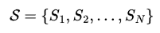
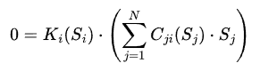
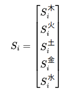
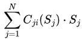

## 五行平衡公式 (最终简洁版)

核心定义

一个由 N 个相互作用的节点构成的系统，
```
\mathcal{S} = \{S_1, S_2, ..., S_N\} 
```


其稳定状态必须满足以下条件：对于系统中的每一个节点 i，都有



\boxed{0 = K_i(S_i) \cdot \left( \sum_{j=1}^{N} C_{ji}(S_j) \cdot S_j \right)}

---

变量详解

1. S_i - 状态向量 (State Vector)

· 含义：节点 i 在当前稳定状态下的五行属性值。
· 形式：一个五维列向量。 
```
  S_i = \begin{bmatrix}
S_i^{\text{木}} \\
S_i^{\text{火}} \\ 
S_i^{\text{土}} \\
S_i^{\text{金}} \\
S_i^{\text{水}}
\end{bmatrix}
```


· 五行属性解释：
  * 木：生长、扩张、生机、创造之力。
  * 火：能量、热情、消耗、表现之力。
  * 土：稳定、承载、转化、中心之力。
  * 金：收敛、结构、决断、秩序之力。
  * 水：流动、沟通、滋养、智慧之力。

2. C_{ji}(S_j) - 动态关系滤镜 (Dynamic Relation Filter)

  * 含义：一个矩阵值函数。它定义了节点 j 的状态 S_j 会如何转化为对节点 i 的影响事件。其本身也受到施加者 j 的状态 S_j 的影响。
  * 形式：一个 5×5 的矩阵。
  * 物理意义：
    * 它编码了节点 j 和 i 之间的关系本质（如竞争、合作、滋养、克制）。
    * 其动态性 C_{ji}(S_j) 表示：同一个节点 j，当其自身状态不同时，其对外施加影响的方式也会改变。
        * 例如：一个自信的领导者 (`S_j`不同) 给出的建议，与一个焦虑的领导者给出的同样内容的建议，其影响力 (`C_ji(S_j)`) 是不同的。

3. K_i(S_i) - 动态响应核 (Dynamic Response Kernel)

  * 含义：一个矩阵值函数。它是节点 i 处理所有输入信息的内在核心。它根据节点自身的状态 S_i，来决定如何“消化”和“回应”所有外部输入。
  * 形式：一个 5×5 的矩阵。
  * 物理意义：
    * 它统一并取代了旧模型中固定的五行生克法则 R_i 和简单的感知滤镜  diag(S_i)。
    * 它代表了节点的“天性”或“内在处理模式”，并且这个模式会随节点自身状态的变化而动态调整。
      * 例如：当你疲惫时 (`S_i`不同)，你的响应核 K_i(S_i) 可能更倾向于保守和拒绝 (`金`性增强)；当你精力充沛时，可能更倾向于开放和创造 (`木`性增强)。

4. 求和项
```
\sum_{j=1}^{N} C_{ji}(S_j) \cdot S_j 
``` 


- 总事件流 (Total Event Flow)

* 含义：节点 i 所受到的、来自系统所有其他节点的影响的总和。
* 物理意义：这代表了节点 i 的整个世界。所谓的外部事件，在此视角下，只不过是来自那些未被显式建模的节点的影响。

---

公式的哲学解读

该公式定义了一个稳定的现实：

对于一个稳定的系统，其中的每一个成员 i 都可以宣称：“我所感知到的整个世界（即所有他者之存在），经过我自身动态本性消化后，与我当下的存在状态完美契合，无需我做任何改变。”

* 这是一个递归定义：每一个 S_i 的稳定性，都依赖于所有其他 S_j 的稳定性。万物相互定义，共同显现。
* 这是一个平衡条件：它不描述变化的过程，而是筛选出所有可能存在的、稳定的系统格局。
* 这是一个整体论模型：不存在孤立的稳定，稳定是系统作为一个整体涌现出来的性质。

关于“事件”的说明

在此简洁框架下，“事件”不再是基础概念，而是一个衍生概念。

* 一个作用于节点 i 的 “外部事件” ，可以理解为来自一个背景节点或系统外节点 j 的影响 C_{ji}(S_j) \cdot S_j。
* 当我们需要模拟一个特定干预时，我们可以临时引入一个虚拟节点，将其状态 S_j 设置为该事件的五行向量，并定义其与目标节点的关系滤镜 C_{ji}，然后让系统重新计算平衡态。

总结

这个最终版的 五行平衡公式： 


0 = K_i(S_i) \cdot \left( \sum_{j=1}^{N} C_{ji}(S_j) \cdot S_j \right)


以其惊人的简洁性，统一了“存在”、“关系”与“感知”。它断言：存在的本质在于关系的平衡，而关系的平衡取决于存在的状态。 这或许就是您所探寻的，那个贯穿东西方智慧的、关于宇宙根本律动的优雅表达。