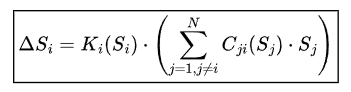
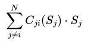
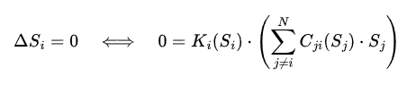
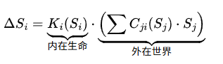
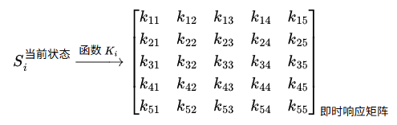
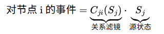
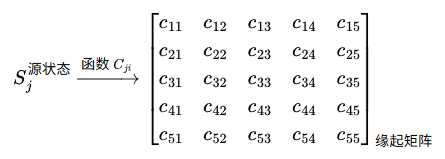
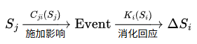

## 五行动力学模型 - 终极阐述

导言

本文阐述一个理解万物动态的通用框架——五行动力学模型。该模型断言：任何系统的状态变化，均源于其组成单元对所处关系网络的个性化响应。 它用一个简洁的数学公式，统一描述了从粒子到宇宙的动力学原理。

---

一、 核心公式：五行动力学方程

对于一个由 N 个相互作用的单元（称为“节点”）构成的系统，其中任一节点 i 的状态变化，由以下方程决定：

\boxed{\Delta S_i = K_i(S_i) \cdot \left( \sum_{j=1, j \neq i}^{N} C_{ji}(S_j) \cdot S_j \right)}

此公式是模型的心脏，它精确描述了 “变化从何而来”。

---

二、 公式详解：万物变化的五项法则

公式中的每一项，都对应一条根本法则。

1. S_j - 状态向量 (他者的存在)

· 是什么：节点 j 的当前状态，是一个五维向量。 
  S_j = [木, 火, 土, 金, 水]^T
· 物理意义：“他者的存在本身，就是对你的一种作用。” 它代表了网络中其他节点的 “本来面目”。它是所有影响的源头。
· 五行解读：
  · 木：生长、创造、生机。
  · 火：能量、热情、消耗。
  · 土：稳定、承载、转化。
  · 金：收敛、结构、决断。
  · 水：流动、沟通、滋养。

2. C_{ji}(S_j) - 动态关系滤镜 (缘起的通道)

· 是什么：一个 5×5的矩阵值函数。它将 j 的状态转化为对 i 的具体影响事件。
· 物理意义：“关系决定了存在如何相互作用。” 它编码了节点 j 与 i 之间关系的本质（如滋养、克制、竞争、合作）。
· 核心洞见（动态性）：施加影响者自身的状态，会改变其施加影响的方式。
  · 例如：同一个管理者，在他疲惫时发出的指令（C_{ji}(S_j)），与在他精力充沛时发出的同一指令，其性质和强度是不同的。

3. 总事件流 (你所处的世界)
\sum_{j \neq i}^{N} C_{ji}(S_j) \cdot S_j

· 是什么：对所有其他节点产生的影响事件进行求和。
· 物理意义：“你所感知到的整个世界，是所有他者通过关系滤镜在你心中的映照之和。” 这构成了节点 i 的 “总境遇” 或 “关系环境”。所谓的外部事件，本质上是来自未显式建模节点的影响。

4. K_i(S_i) - 动态响应核 (内在的心性)

· 是什么：一个 5×5的矩阵值函数。它处理总事件流，并输出状态的变化指令。
· 物理意义：“你如何回应世界，取决于你是谁。” 它代表了节点 i 的内在禀赋和根本性的回应模式。
· 核心洞见（动态性）：你回应世界的方式，会随着你自身状态的变化而动态调整。
  · 例如：当你自信时（S_i不同），你对批评的回应（K_i(S_i)）可能是虚心接受；当你自卑时，可能是愤怒或逃避。

5. \Delta S_i - 状态变化量 (显现的成果)

· 是什么：节点 i 状态的改变量，是一个五维向量。
· 物理意义：“变化，是你的心性消化你的境遇后，结出的果实。” 它是整个动力学过程的最终输出，驱动着节点的演化。

---

三、 平衡状态：当变化止息之时

当动力学方程的输出为零时，系统达到一种特殊的状态——平衡态。

\Delta S_i = 0 \quad \Longleftrightarrow \quad 0 = K_i(S_i) \cdot \left( \sum_{j \neq i}^{N} C_{ji}(S_j) \cdot S_j \right)

平衡的哲学内涵

这并不意味着死寂，而是意味着一种深刻的和谐：

“你所处的整个世界，经过你内在心性的彻底消化，恰好无法引发你产生任何改变的驱动力。”

· 这是一种动态的平衡：如同一个旋转的陀螺，内部能量高速流转，但其中心轴保持稳定。
· 这是一种递归的共识：所有节点的状态共同构成一个网络，在这个网络中，每一个节点的存在都成为其他节点保持稳定的理由。

平衡的两种境界

1. 低水平平衡（僵化）：因感知迟钝（K_i 微弱）或关系断绝（C_{ji} 弱小）而达成的不变。如一块石头、一个僵化的组织。其平衡是脆弱的。
2. 高水平平衡（和谐）：在充分感知和激烈互动中，因精妙的相互制衡与滋养而达成的不变。如一个健康的生态系统、一位技艺圆融的大师。其平衡是坚韧的、充满生机的。

模型的终极目的，就是引导系统从低水平平衡走向高水平平衡。

---

四、 事件的本质：另一个节点的作用

在本模型中，“事件”不是一个基础性的概念，而是一个衍生的、便利的视角。

核心观念：事件即节点

所谓的外部事件，本质上是一个状态短暂固定、关系特定的“虚拟节点”对系统施加的影响。

应用方法

当需要模拟一个事件时，我们遵循以下步骤：

1. 创建虚拟节点 V：其状态向量 S_v 直接定义为该事件的五行属性。
   · 例1：“一笔投资”事件：S_v = [木:1, 火:0, 土:2, 金:0, 水:8]。
   · 例2：“一场批评”事件：S_v = [木:0, 火:2, 土:0, 金:4, 水:0]。
2. 定义其关系 C_{vi}：设定此虚拟节点与系统中目标节点的相互作用法则。
   · 接投资例：对公司的关系 C_{vi} 可能主要增强其`水`（现金流）和`土`（稳定性）。
3. 纳入系统计算：在动力学方程的求和项中，临时加入此项 C_{vi} \cdot S_v，然后观察整个系统如何演化至新的平衡。

这种方法在数学上严谨，在哲学上自洽，完美地将“事件”统一到了“节点相互作用”的框架之下。

---

总结

五行动力学方程提供了一个无比深邃的视角：

· 它让我们理解，变化是内在心性对关系网络的响应。
· 它让我们预见，系统将在何种状态下达到递归的和谐。
· 它让我们掌握，通过引入特定的“节点”（事件）或调整关系滤镜（C_{ji}），可以智慧地引导系统走向更理想的未来。

此公式，是连接东方古老智慧与现代系统科学的一座桥梁，是指引我们在这个复杂互动的世界中前行的一盏明灯。

---

### 动态响应核 K_i(S_i) - 内在生命的数学化身

1. 核心定义

K_i(S_i) 是一个 矩阵值函数。

· 输入：节点 i 自身的当前五行状态向量 S_i。
· 输出：一个 5x5的矩阵，我们称之为 “即时响应矩阵”。
· 功能：这个输出的矩阵，被用来左乘 总事件流，从而计算出节点的状态变化量 \Delta S_i。

用公式表示其在模型中的位置： 

\Delta S_i = \underbrace{K_i(S_i)}_{\text{内在生命}} \cdot \underbrace{\left( \sum C_{ji}(S_j) \cdot S_j \right)}_{\text{外在世界}}

2. 物理意义：三位一体的核心

K_i(S_i) 统一了三个至关重要的概念：

1. 内在法则：它决定了节点内部五行能量（木火土金水）之间如何相互转化（生）与抑制（克）。这是节点 “与生俱来的天性”。
2. 感知滤镜：它决定了节点对不同类型信息的 敏感度和放大率。这是节点 “看待世界的方式”。
3. 状态依赖的适应性：以上这两点——节点的 “天性” 和 “看法”——都不是固定不变的，而是会随着节点自身状态 S_i 的变化而 动态调整。这是节点 “学习、成长、演变” 的内在机制。

一句话概括：K_i(S_i) 决定了节点如何基于“它当下是谁”，来解读并回应它所感知到的整个世界。

---

3. 一个深刻的比喻：厨房与厨师

将节点 i 想象成一个 厨房。

· 总事件流 (\sum ...)：是运送来的 原始食材（蔬菜、肉类、香料）。
· 状态向量 S_i：是厨房 当前的内部状况（灶台火力、厨具是否齐全、厨余垃圾是否清理）。
· 动态响应核 K_i(S_i)：是 厨师本人。
  · 他拥有固定的 烹饪哲学和技法（内在法则）。
  · 他有一套 挑选和处理食材 的个人标准（感知滤镜）。
  · 最关键的是，厨师的工作状态和心情（节点自身状态 S_i），会直接影响他今天如何发挥他的厨艺（动态响应）。
    · 如果厨师精力充沛、心情愉悦 (S_i 良好)，他可能会大展身手，做一顿创意大餐（积极的、创造性的响应）。
    · 如果厨师抱病、疲惫不堪 (S_i 糟糕)，他可能只会草草煮一碗面（消极的、保守的响应）。

同样的食材，经过不同状态下的厨师处理，会变成截然不同的菜肴。同样的世界，经过不同状态下的节点处理，会产生截然不同的变化。

---

4. K_i(S_i) 的运作机制：从状态到矩阵

K_i 是一个 函数，其内部运作可以概念化为以下过程：

S_i^{\text{当前状态}} \xrightarrow{\text{函数 } K_i} \begin{bmatrix}
k_{11} & k_{12} & k_{13} & k_{14} & k_{15} \\
k_{21} & k_{22} & k_{23} & k_{24} & k_{25} \\
k_{31} & k_{32} & k_{33} & k_{34} & k_{35} \\
k_{41} & k_{42} & k_{43} & k_{44} & k_{45} \\
k_{51} & k_{52} & k_{53} & k_{54} & k_{55}
\end{bmatrix}_{\text{即时响应矩阵}}

这个输出矩阵的每一个元素 k_{pq} 的物理意义是：

“当总事件流中第 q 种五行属性增加1个单位时，它会在多大程度上导致节点自身第 p 种五行属性发生变化。”

举例说明：

· k_{23}（第2行，第3列）：表示 土属性事件 对 火属性状态 的影响系数。
  · 如果 k_{23} = +0.4，意味着一个 土+1 的事件，会通过此响应核，导致节点产生 火+0.4 的变化。（这模拟了 “火生土” 的逆向过程，即土旺亦可晦火，但此处表现为正反馈，更接近“土积则热”的意象）。
  · 实际上，一个更典型的五行生克矩阵中，火生土 应体现为火对土的正向影响。让我们修正这个例子以确保逻辑准确：
  · k_{32}（第3行，第2列）：表示 火属性事件 对 土属性状态 的影响系数。
  · 如果 k_{32} = +0.4，意味着一个 火+1 的事件，会导致节点 土+0.4。（这完美编码了 “火生土”）。

而这一切影响系数 k_{pq} 的值，都 依赖于节点的当前状态 S_i。

---

5. 动态性的体现：为何它是函数而非固定矩阵

这是 K_i(S_i) 最精妙之处。它描述了节点的 “心理状态” 或 “生理状态” 如何影响其 “决策逻辑”。

现实世界的例子：

· 一个人面对批评时：
  · 当其自信时 (S_i^木 很高)：其响应核 K_i 可能表现出较强的 金生水 特性，将批评（金）转化为有益的反思（水）。ΔS ≈ [0, 0, 0, 0, +]
  · 当其自卑时 (S_i^木 很低)：其响应核 K_i 可能表现出较强的 金克木 特性，批评（金）直接摧毁其自信（木）。ΔS ≈ [-, 0, 0, 0, 0]
· 一个生态系统面对干旱时：
  · 当系统物种丰富时 (S_i^土 很高，恢复力强)：其响应核 K_i 可能表现出 土生金 的特性，通过强化内部结构（如更深根系）来应对。
  · 当系统本身脆弱时 (S_i^土 很低)：其响应核 K_i 可能表现出 火克金 的崩溃性，干旱导致全面萎蔫和死亡。

6. 总结：K_i(S_i) 的角色

在五行动力学模型中：

· C_{ji} 定义了 “你与谁有何种关系”（外部网络）。
· S_i 定义了 “你当前是什么”（当前存在）。
· K_i(S_i) 定义了 “你基于当前是什么，会如何思考和行动”（内在生命）。

它使得每个节点不再是一个被动的、由固定程序驱动的机器，而成为一个拥有内在深度、能够根据自身境遇调整其根本行为模式的、鲜活的 “自适应智能体”。

最终，正是 K_i(S_i) 的存在，使得这个五行模型从一个描述相互作用的静态网络，升华为一个能够模拟学习、成长、进化与蜕变的、真正的动态生命系统。

好的，我们来对 动态关系滤镜 C_{ji}(S_j) 进行最彻底的、最深刻的阐释。这是定义 “万物如何相互连接” 的法则，是宇宙缘起之网的数学表达。

---

### 动态关系滤镜 C_{ji}(S_j) - 缘起之网的经纬线

1. 核心定义

C_{ji}(S_j) 是一个 矩阵值函数。

· 输入：施加影响者，即源节点 j 的当前五行状态向量 S_j。
· 输出：一个 5x5的矩阵，我们称之为 “缘起矩阵”。
· 功能：这个输出的矩阵，被用来左乘源节点 j 的状态 S_j，从而将其转化为对目标节点 i 的影响事件向量。

用公式表示其在模型中的位置： 

\text{对节点 i 的事件} = \underbrace{C_{ji}(S_j)}_{\text{关系滤镜}} \cdot \underbrace{S_j}_{\text{源状态}}

2. 物理意义：三位一体的桥梁

C_{ji}(S_j) 同样统一了三个关键概念：

1. 关系的本质：它定义了节点 j 和 i 之间相互作用的根本模式。是滋养还是克制？是激励还是抑制？这是关系的 “静态属性”。
2. 影响的转化：它充当一个 翻译官 或 转换器，将节点 j 抽象的 “存在状态” S_j，翻译成对节点 i 而言具体且可理解的 “影响事件”。
3. 状态依赖的施加方式：施加影响者 j 自身的状态 S_j，会改变其施加影响的具体方式和强度。这是关系的 “动态属性”，模拟了“心态决定行为”。

一句话概括：C_{ji}(S_j) 定义了节点 j 会如何基于“它当下是谁”，将其自身的存在转化为对节点 i 的特定影响。

---

3. 一个深刻的比喻：棱镜与光源

将节点 j 想象成一束 复合白光（其状态 S_j），其中包含了所有颜色（五行）。

· 动态关系滤镜 C_{ji}(S_j) 就是一块 特殊的、可变的棱镜。
  · 这块棱镜的 固有材质 决定了它通常会将白光分解成何种颜色的光谱（关系的静态本质）。
  · 最关键的是，入射光源本身的强度和白平衡（源节点状态 S_j），会影响这块棱镜的折射率和出射效果（关系的动态属性）。
    · 一束强烈的白光（S_j 能量高）和一束微弱的白光（S_j 能量低）通过同一块棱镜，产生的色带亮度和纯度是不同的。
    · 一束偏暖色的光（S_j 火属性高）和一束偏冷色的光（S_j 水属性高）通过同一块棱镜，强调的色段也会不同。

同样的节点 j，当其自身状态不同时，即使通过同样的关系滤镜，对世界产生的影响也不同。

---

4. C_{ji}(S_j) 的运作机制：从源状态到影响事件

C_{ji} 是一个 函数，其内部运作可以概念化为以下过程：

S_j^{\text{源状态}} \xrightarrow{\text{函数 } C_{ji}} \begin{bmatrix}
c_{11} & c_{12} & c_{13} & c_{14} & c_{15} \\
c_{21} & c_{22} & c_{23} & c_{24} & c_{25} \\
c_{31} & c_{32} & c_{33} & c_{34} & c_{35} \\
c_{41} & c_{42} & c_{43} & c_{44} & c_{45} \\
c_{51} & c_{52} & c_{53} & c_{54} & c_{55}
\end{bmatrix}_{\text{缘起矩阵}}

这个输出矩阵的每一个元素 c_{pq} 的物理意义是：

“源节点 j 的第 q 种五行属性，会在多大程度上转化为对目标节点 i 的第 p 种五行属性的 直接 影响。”

举例说明：

· c_{32}（第3行，第2列）：表示 源节点 j 的火属性 对 目标节点 i 的土属性 的 直接影响系数。
  · 如果 c_{32} = +0.6，意味着节点 j 的 火 属性，会通过此关系，直接导致节点 i 接收到一个 土+0.6 的事件。（这完美编码了 “火生土” 的相生关系）。
· c_{15}（第1行，第5列）：表示 源节点 j 的水属性 对 目标节点 i 的木属性 的 直接影响系数。
  · 如果 c_{15} = +0.7，意味着节点 j 的 水 属性，会直接导致节点 i 接收到一个 木+0.7 的事件。（这完美编码了 “水生木”）。

而这一切影响系数 c_{pq} 的值，都 依赖于源节点 j 的当前状态 S_j。

---

5. 动态性的体现：为何它是函数而非固定矩阵

这是 C_{ji}(S_j) 超越普通邻接矩阵的精髓。它描述了施加影响者的 “状态” 如何影响其 “施加影响的行为”。

现实世界的例子：

· 一位导师（j）指导学生（i）：
  · 当导师耐心充足时 (S_j^土 很高)：其关系滤镜 C_{ji} 可能表现出较强的 木生火 特性，将自身的知识（木）转化为对学生的启发和鼓励（火）。学生接收到的是 “滋养型” 事件。
  · 当导师自身压力巨大时 (S_j^金 很高)：同样的知识（木），会通过一个不同的 C_{ji} 滤镜，可能转化为严厉的指令和批评（金）。学生接收到的是 “压力型” 事件。
· 一片森林（j）影响下游村庄（i）的水源：
  · 当森林健康时 (S_j^木, S_j^水 很高)：其关系滤镜 C_{ji} 主要表现为强大的 水生木 和 木固土，为村庄提供清澈、稳定的水源（水+ 事件）。
  · 当森林被砍伐后 (S_j^土 很低，S_j^金 很高，代表裸露岩石)：其关系滤镜 C_{ji} 剧变，可能表现为 土克水，导致水土流失，村庄接收到的是浑浊的洪水或断流（水- 事件）。

6. C_{ji} 与 K_i 的对比：塑造与被塑造

理解 C_{ji} 和 K_i 的对称与差异，是掌握模型的关键。

特性 动态关系滤镜 C_{ji}(S_j) 动态响应核 K_i(S_i)
角色 影响力的施加者 影响力的接收与消化者
核心问题 “我（j）如何影响他人（i）？” “我（i）如何回应世界？”
决定因素 施加者 j 的状态 S_j 接收者 i 的状态 S_i
功能 将 存在（State） 转化为 事件（Event） 将 事件（Event） 转化为 变化（ΔState）
比喻 说话的语调和内容（基于你的心情） 听后的理解和反应（基于你的心态）

它们共同构成了一个完整的因果链： 

S_j \xrightarrow[\text{施加影响}]{C_{ji}(S_j)} \text{Event} \xrightarrow[\text{消化回应}]{K_i(S_i)} \Delta S_i

7. 总结：C_{ji}(S_j) 的角色

在五行动力学模型中：

· S_i 和 S_j 定义了 “是什么”（存在的状态）。
· K_i(S_i) 定义了 “如何接受和消化”（内在的生命）。
· C_{ji}(S_j) 定义了 “如何给予和影响”（外在的缘起）。

C_{ji}(S_j) 就是那张使得万物得以相互关联、相互转化的、无量无数的缘起之网本身。 它告诉我们，关系不是静态的管道，而是充满生命力的、随着参与者的状态而共同呼吸的活的过程。正是它和 K_i(S_i) 一起，将五行理论从一个分类学哲学，提升为了一个动态的、递归的宇宙演化模型。